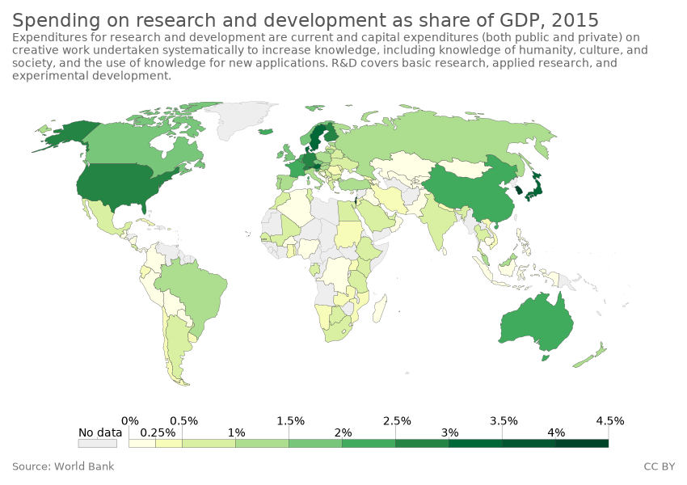
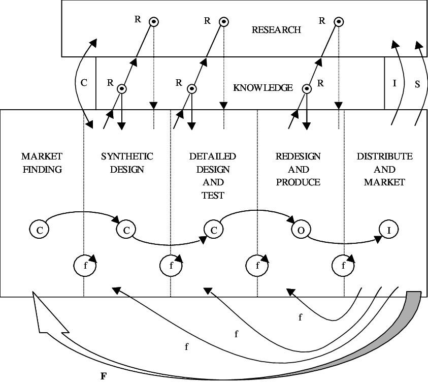
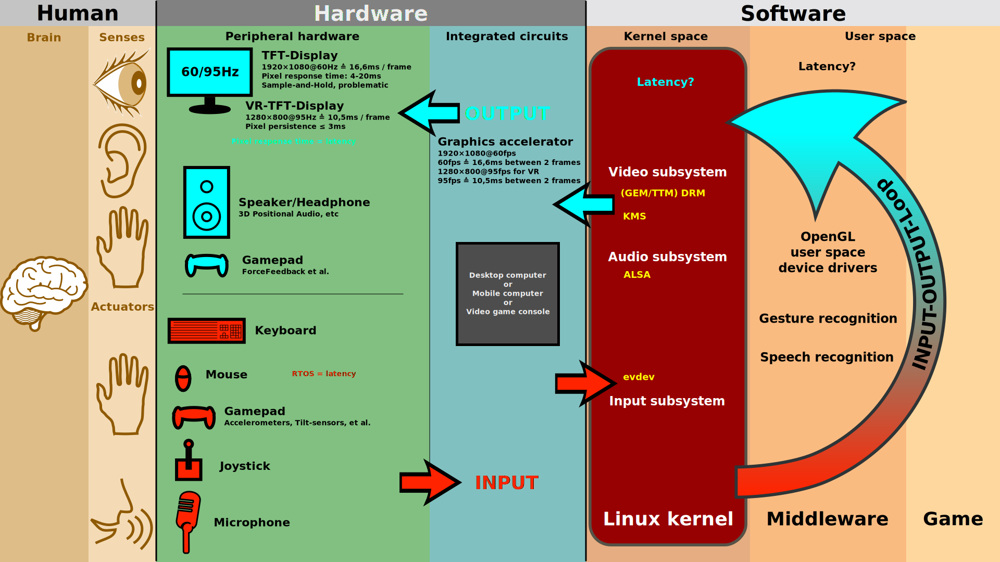
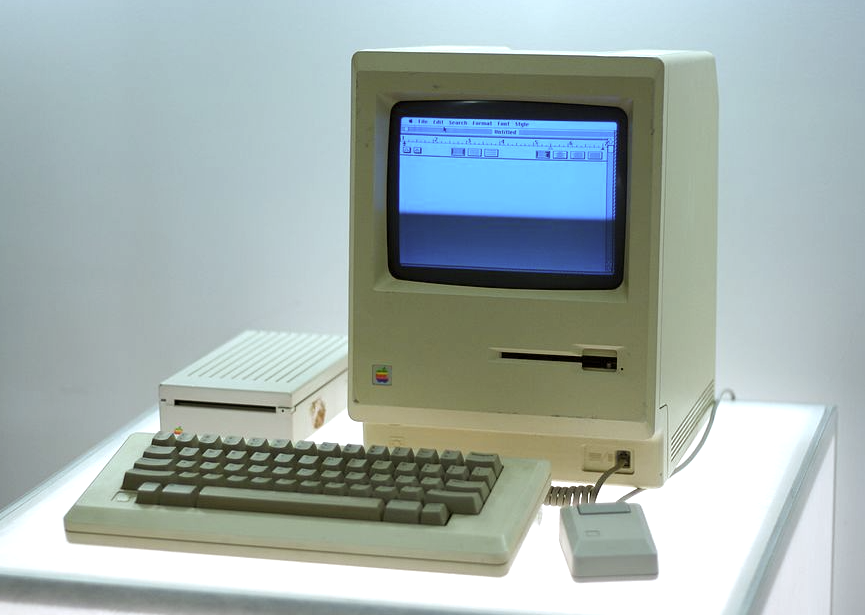
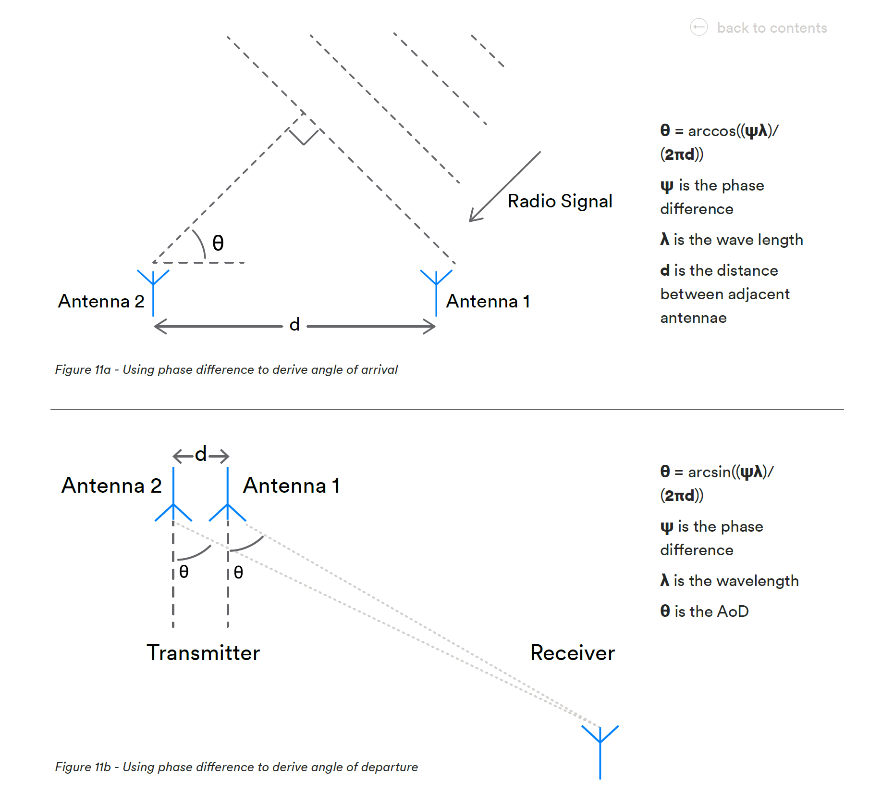

# HCI中的技术创新及其推动经济发展机制综述

张庭梁 	2020213677 	美术学院信息艺术设计（交叉学科）

## 引言

本文从界定技术创新的概念、特征与类型开始，介绍了笔者研究领域Human–computer interaction (HCI)人机交互方向及其属于技术创新的方面，并用苹果公司的发展和两个我最近做/想的实例来具体阐释HCI领域的技术创新是如何推动经济增长的，以及HCI从业者在新时代面临的机遇和挑战。最后引出关于需求带动技术还是技术带动应用的讨论。通过这些总结和探索提出一些自己的有关创新创业中科学技术观的思考和见解。

## 技术创新的概念、特征与类型

### 技术创新的概念

在自然辩证法课程的第三篇  科学技术观、第九章 科学技术与社会、第二节 科学技术推动经济发展的创新机制之一技术创新中提到：

第一个提出创新概念的是，美籍奥地利经济学家熊比特(J．A．Schumpeter)。

“创新”(Innovation) 是将原始生产要素重新排列组合为新的生产方式，以求提高效率、降低成本的一个经济过程。在熊彼特经济模型中，能够成功“创新”的人便能够摆脱利润递减的困境而生存下来，那些不能够成功地重新组合生产要素之人会最先被市场淘汰。熊彼特认为，因创新而获取暂时性垄断权，并由此而获得超额回报，这超额回报即“熊彼特租金”。[1](#refer-anchor-1)

技术创新是技术方面与技术相关的创新，是发明的首次商业化应用。 创新则是发明的商业化过程或商业化结果

除了纯技术创新之外，其他方面如商业模式、管理等也属于创新，同样能推动经济发展。

研究开发(英语：Research and development；缩写：R&D)，或译研究与开发，简称研发 ，是隶属于企业、大学及国家的机构所开展的科学项目研究与技术开发活动。[2](#refer-anchor-2)

中国的研究开发投资总量及强度于1990年代末期以来增长迅速，除了中国经济继续高速扩张等一些必然因素外，中国决策层在发展中重视科技投资及企业加大投资是造成这一现象的主要原因。

### 技术创新过程

技术创新过程是一个将知识、技能和物质转化成顾客满意的产品的过程；是知识的产生、创造和应用的进化过程；是一个信息。交流、加工的过程；是企业提高技术产品附加价值和增强竞争优势的过程。

企业技术创新过程涉及创新构思产生、研究开发、技术管理与组织、工程设计与制造、用户参与及市场营销等一系列活动。在创新过程中，这些活动相互联系，有时要循环交叉或并行操作。技术创新过程不仅伴随着技术变化，而且伴随着组织与制度创新、管理创新和营销方式创新。因此，在广义上，企业技术创新还包括组织与制度创新、管理创新和市场创新。从20世纪60年代以来，国际上出现了五代具有代表性的企业技术创新过程模型。[3](#refer-anchor-3)

我们以第三代模型：链环-回路模型（Chain-Linked Model）为例分析。

一个好的能够迅速市场化的创新一般情况下其实是从市场需求出发的，在市场有迫切需求的时候，从需求出发的创新很快能落地应用。但是大多数情况下，院校内的科研往往是追求新技术的，绝大多数技术并不能在短时间内为市场所接受，总会有各种各样的问题存在，比如成本太高，存在安全隐患，并非大多数人目前需求等等。

### 技术创新与经济增长

熊彼特在其经典著作《经济发展理论》中指出，技术创新与经济增长密不可分，技术创新导致经济增长，技术创新实现的过程就是经济增长的过程。技术创新是经济增长的动力和源泉，创新越活跃经济增长的速度就越快，创新不足则经济难以增长。世界经济发展史证明，一个先进国家经济的衰落是由于其技术创新活动的衰落；一个落后国家经济的兴起是由其技术创新活动的兴起。

## HCI简介及其技术创新

Human–computer interaction (HCI)，人机交互，研究计算机技术的设计和使用，重点是人（用户）与计算机之间的接口。HCI领域的研究人员观察人类与计算机交互的方式，并设计使人类以新颖方式与计算机交互的技术。

用户可以通过图形用户界面GUI直接与诸如显示器之类的用于人类输入和输出的硬件进行交互。用户使用给定的输入和输出（I / O）硬件，通过此软件接口与计算机进行交互。软件和硬件是匹配的，因此用户输入的处理足够快，并且计算机输出的延迟不会破坏工作流程。[4](#refer-anchor-4)

HCI中很重要的一环是人机交互界面（The human–computer interface），包括：视觉界面、听觉界面、触觉反馈等

以下内容为我个人观点，可能带有主观性：近期HCI的创新点主要集中在以下几个方面：新的交互界面or设备，新的互动方式（如新的手势），用户体验的评价体系。

而随着新技术的发展，HCI在以下几个方面有较快商业化的创新：

嵌入式计算：嵌入式计算正在超越计算机进入生活之中。从烹饪设备到照明和卫生设备到百叶窗到汽车制动系统再到贺卡，嵌入式系统需要很少的自动化元件就可以使环境焕然一新。未来增加的网络通信将让许多嵌入式计算相互之间以及与用户进行协调。这些嵌入式设备的人机界面将与传统计算机的人机界面完全不同。

增强现实设备：VR或者AR设备中的人机交互方式能够提供给人更多的信息，所以其中的界面甚至设备本身的设计还没有被充分探索。

情感计算：通过脑机接口等识别采集人类情感，并研究计算机如何检测，处理和响应人类的情感。在VUI（Voice UI语音界面）中有很多用途，比如智能音箱通过判定人类语音中的情感取向选择不同的回答方式。

## HCI领域技术创新推动经济增长

本节以苹果公司的发展和两个我最近做/想的实例来具体阐释HCI领域的技术创新是如何推动经济增长的，以及HCI从业者在新时代面临的机遇和挑战。正如课程中所说的，从经济学家的观点看，科学家得到工资，他们是职业的雇员，靠科学劳动谋生。

### 苹果设计和其兴衰

苹果公司早期和近期的兴起，都和他的人机交互设计有关。

Apple Macintosh于1984年发布，是第一个面向大众市场有完整的图形用户界面(GUI)和鼠标的个人电脑。其实从这台电脑中，我们可以看到很多现代电脑有的特点。

GUI和鼠标的出现革新了人和计算机交互的方式，和传统命令行需要通过大量学习才能掌握形成鲜明对比。其实鼠标和GUI是施乐PARC研究院第一个做出来的，但乔布斯在参观后立即确信，未来所有的计算机都将使用图形用户界面，然而施乐的高层则认为mouse很可笑。乔布斯看到了GUI中的革命性价值，很快针对Apple Lisa开发了GUI。

在2007年1月9日的Macworld博览会上的演讲中，乔布斯宣布苹果计算机公司此后将被称为“苹果公司”，因为该公司已将重点从计算机转移到了消费电子产品。并宣布了iPhone的发布。在销售的前30小时内售出了270,000部iPhone，该设备被称为“行业改变者”。截至2018年11月1日，已售出超过22亿部iPhone。iPhone已因普及智能手机和平板电脑外形而闻名，并为智能手机应用程序或“应用程序经济”创造了广阔的市场。

乔布斯在做iPhone的时候的愿景是想要做一个能拿在手上的玻璃，彻底改变手机的操作方式。

今天的苹果，市值为33.85亿美元，2019年净收入55,256百万美元，毫无疑问是推动经济发展的一大推手。

而苹果也成为将HCI商业价值充分发挥出来的典范，在GUI诞生并商用化之后，各大公司陆续新增了一些职位：交互设计师、用户体验工程师、用户界面设计师等，来进一步将商品变得更人性化，更适用不同的用户，

### 无接触隔间门锁

这是一个从生活中来的想法。在使用公共厕所的隔间的时候，在整个流程中，我们会接触到的部分只有隔间的门锁，假设已经是自动冲水或者脚踩的，特别是在比较脏的环境中，接触总会让人感觉厌恶，所以我想通过做一个手势控制的自动门锁来解决接触的问题。

我做了一些调查，发现大家喜欢的开门手势可能是讲手悬停在门锁前，更多的则是左右挥手仿佛在隔空控制锁的插销。所以门内外各一个简单是手势识别就可以了，总成本能控制在十块钱人民币左右，是一个廉价的解决方案。

而这个小装置又切实解决了一个问题，实现整个流程的无接触设计，在后疫情时代显得尤其重要。

而最近也找到了风投，或许有进一步商用的价值。

但是，只是解决了一个小场景，能用的方式有限，所以和苹果相比，并不能带来革新性的进步，但小的技术应用场景的创新也能确实带来一点点的经济增长。

### 室内定位技术对于HCI研究和应用的影响

室内定位在近些年技术发展很快，从iPhone11上用的UWB定位可以指向性传文件，到今年发布的BLE5.1标准让未来的蓝牙也具备了一定的空间定位能力。技术的创新带来的是HCI方式的更多可能性。

以蓝牙SIG于2019年1月21日推出了蓝牙5.1为例，它提供的用于设备的定位和跟踪的Angle of Arrival (AoA) and Angle of Departure (AoD)提供了最小10cm精度的空间定位能力，也就是说当蓝牙设备（如手机）连接上另一个具有两个及以上天线的蓝牙设备（如一个基站），基站就能知道手机等设备的方位和距离。

这一技术可以应用在很多方面，比如在一些重要的东西比如钥匙等上附上BLE Tag，就可以知道东西在哪，不需要到处翻找；可以用来做室内导航，比如大商场或者地下超市里面没有GPS信号，用几个蓝牙基站就可以知道自己的精确位置；还可以用在未来的工场里面做机器人集群，特别是物流仓库里的调度。

每一个应用场景都有商业价值，这也是最近用到UWB或BLE定位做演示的公司的愿景，比如小米做的魔杖遥控器，指向一个设备就能控制它。苹果做的iBeacon Tag可以防丢等等。

## 总结

HCI是一个新兴的领域，人和机器的互动如何更有效，是我们一直在探索的问题。其中一些问题是从生活中来的，即从需求出发，寻求解决方案，这类是按照链环-回路模型（Chain-Linked Model）的正序的，如前文提到的无接触隔间门锁的研究；另一些则是从新技术出发的，在技术开发之初可能并没有考虑到这些应用场景，后提出场景的人也是创新者，如室内定位技术的应用。

其实无论是需求带动技术还是技术带动应用都是可以的，从需求出发的创新很快能落地应用。但另一方面，科研往往是追求新技术的，很多技术并不能在短时间内找到应用，这就有人去寻找新技术的应用。

正如习近平科学技术思想中所说的：创新是引领发展的第一动力。我认为人机交互中的创新应当属于科技创新，它能够提高人们的生活水平，带来商业价值。而这个领域是几乎所有做产品的人都会接触到的，只要是给人使用的产品，就要考虑到用户的感受。易于使用顺应人性的产品才是好产品。在这一方面，很多产品还是要进一步注重用户体验设计，做出易用的好产品。

## 参考文献

 

[1] [MBA智库约瑟夫·熊彼特](https://wiki.mbalib.com/wiki/%E7%BA%A6%E7%91%9F%E5%A4%AB%C2%B7%E7%86%8A%E5%BD%BC%E7%89%B9)

 

[2] [Research and development](https://en.wikipedia.org/wiki/Research_and_development)

 

[3] [技术创新过程模型](https://wenku.baidu.com/view/40267e61a5e9856a5612605a.html)

 

[4] [Human–computer interaction](https://en.wikipedia.org/wiki/Human%E2%80%93computer_interaction)